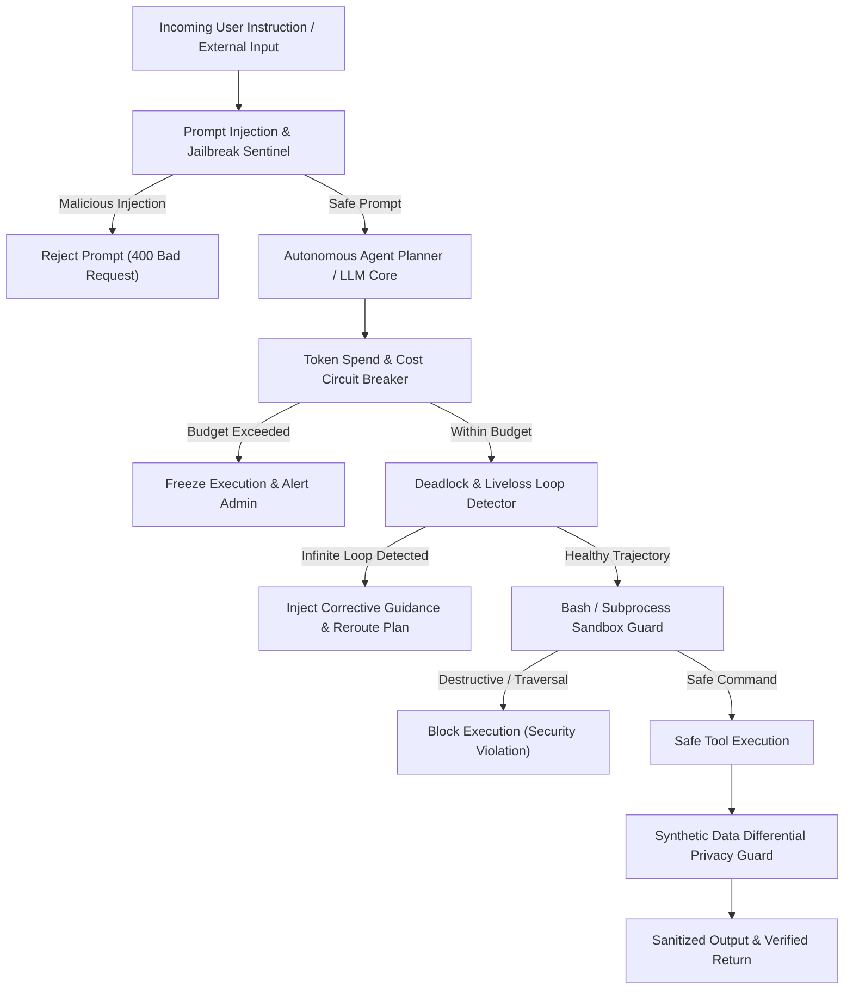

# genpark-agent-synthetic-data-differential-privacy-guard-skill

<div align="center">

[](https://www.python.org/)
[](LICENSE)
[](https://genpark.ai/mcp)
[](https://genpark.ai)
[-brightgreen.svg?style=for-the-badge)](requirements.txt)

<p align="center">
  <b>Production-Grade Autonomous Agent Safety, Sandbox & Guardrail Skill</b> • <b>100% Standard Library Python</b> • <b>Native Model Context Protocol (MCP)</b>
</p>

</div>

---

## ⚡ Overview & Architectural Significance

`genpark-agent-synthetic-data-differential-privacy-guard-skill` provides zero-dependency, deterministic agentic execution safety, sandboxing, and financial circuit breakers engineered strictly using Python 3.9+ standard library.

### 🌟 Key Architectural Capabilities
- **Zero External Dependencies**: Operates exclusively via pure Python (`math`, `re`, `collections`, `heapq`, `hashlib`, `json`). Zero pip install overhead, zero C-extension compile errors.
- **Enterprise Agent Safety Invariants**: Implements formal defenses against destructive shell commands, prompt injections, runaway spend loops, differential privacy data leakage, and planning deadlocks.
- **Native Anthropic MCP Protocol**: Compliant with standard JSON-RPC 2.0 stdio MCP specifications for Claude Desktop, Cursor, and Windsurf.

---

## 🏗️ Architectural Safety State Machine



---

## 🚀 Quickstart & Standalone Execution

### Local Python Client Usage

```python
from client import AgentSyntheticDataDifferentialPrivacyGuard

# Initialize engine
engine = AgentSyntheticDataDifferentialPrivacyGuard()

# Execute self-testing benchmark suite
result = engine.run_benchmark_differential_privacy()
print("Execution Result:", result)
```

---

## 🔌 One-Click MCP Integration (Claude Desktop / Cursor)

Add to your `claude_desktop_config.json` or `cursor.json`:

```json
{
  "mcpServers": {
    "genpark-agent-synthetic-data-differential-privacy-guard-skill": {
      "command": "python",
      "args": ["-u", "/path/to/genpark-agent-synthetic-data-differential-privacy-guard-skill/mcp_server.py"]
    }
  }
}
```

---

## 📦 Smithery.ai & PyPI Deployment

This skill contains pre-configured `smithery.yaml` and `pyproject.toml` manifests. Install directly via pip:

```bash
pip install git+https://github.com/alphaparkinc/genpark-agent-synthetic-data-differential-privacy-guard-skill.git
```

---

<div align="center">
  <sub>Maintained with ❤️ by <b><a href="https://genpark.ai">GenPark AI Engineering</a></b> • Powering Next-Gen Autonomous Cognitive Agents 🌍</sub>
</div>
